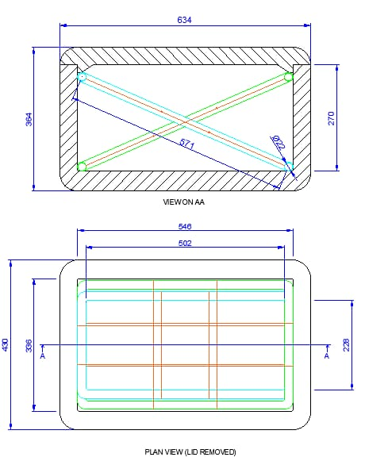

# Building Instructions for ArchiVault

*A step-by-step guide to building a shock-absorbing artifact transport container with an integrated monitoring system.*

## Materials Needed

- 20–25 mm PVC pipes
- Cooler box, or any other large, airtight container, to use as the outer container
- Around 1/2 m² of either non-acidic 4-ply cardboard or polyethylene/polypropylene (amount depends on artifact size)
- Elastic bands
- Slab of Ethofoam (polyethylene foam)
- Silica gel packets
- Micro:bit V2
- Batteries or power bank
- Measuring tape
- Pipe cutter or hacksaw
- Knife
- Ruler
- Tape

*Suspension system reference blueprint*

## Part 1: Building the Suspension System

### Step 1: Measure Your Outer Container

1. **Determine the internal dimensions** of your outer container: length (L), width (W), and depth (D). Measure from inside wall to inside wall.
2. **Decide where the pipes will sit.** They can rest on the rim (if the container has a lip) or on brackets mounted inside. For a typical suspension, pipes are placed across the top opening, but they can also be positioned lower using supports.
3. **Consider the height** at which you want the inner container to hang. The elastic bands will attach from the pipes to the inner container, so the pipes need to sit above the inner container's attachment points.

### Step 2: Plan the Pipe Layout

The reference blueprint uses a "cross-over formation," shown with red and green lines. This means two sets of pipes intersecting, like a grid or an X pattern. You can choose any pattern that provides multiple attachment points for the elastic bands. Common layouts include:

- **Parallel grid:** several pipes running lengthwise and several crosswise, forming a lattice.
- **Diagonal cross:** two or more pipes placed diagonally across the container, crossing at the centre.
- **Radial:** pipes radiating out from the centre.

For a simple and effective suspension, use two sets of parallel pipes — one set along the length and one along the width — so they intersect and form a grid. The number of pipes depends on the size of your container and the load; for example, you might use 3 pipes lengthwise and 3 crosswise.

### Step 3: Calculate Pipe Lengths

For each pipe, measure the distance between the points where it will rest. If a pipe rests on the rim, its length equals the internal dimension (L or W) plus any overhang if it sits on ledges. For diagonal pipes, use the Pythagorean theorem: diagonal = √(L² + W²). Make sure each pipe is long enough to span the gap, with a little extra if it needs to sit on supports.

The reference blueprint uses these specific lengths: 634, 270, 871, 546, 502, 436, and 228 mm, which correspond to different pipes in that particular design. For your own container, you will calculate your own numbers using the method above.

### Step 4: Cut the PVC Pipes

1. Mark each pipe at its calculated length using a marker.
2. Cut squarely using a PVC pipe cutter or hacksaw. A pipe cutter gives a cleaner cut.
3. After cutting, deburr the ends with sandpaper or a deburring tool to remove sharp edges that could damage elastic bands or scratch the container.

### Step 5: Arrange the Pipes Inside the Container

1. Place the cut pipes inside the container according to your planned layout. They should rest securely on the rim or supports. If the container has a smooth rim, add adhesive felt pads to prevent slipping.
2. Make sure the pipes are level and spaced evenly. For a grid layout, lay the first set (e.g. lengthwise) and then the second set (crosswise) on top of them to create an intersection. The pipes can simply rest on each other; they don't need to be fastened unless the load will shift them.

### Step 6: Attach Elastic Bands to Suspend the Inner Container

1. **Attach one end of each band** to a pipe. Loop the band around the pipe and tie it, or use a hook if the band has one. Make sure the band is secure and won't slip.
2. **Attach the other end** to the inner container. Repeat for all bands, distributing them evenly around the container. The number of bands you need depends on the weight — more bands provide more support.
3. **Adjust the tension** so the inner container is suspended without touching the bottom or sides of the outer container. You may need to adjust band lengths or positions to get this right.

## Part 2: Building the Inner Container

### Step 1: Measure the Cardboard or Polymer Pieces

1. **Obtain the dimensions of the objects.** Photographs that include measurements can help, but seeing and examining the objects in person is important.
2. **Add packing allowances.** Add a minimum of two inches on all sides, including the top and bottom, between the object and the box to allow space for packing material.
   - When packing multiple objects in one box, leave space between objects for packing material.
   - Objects made of similar material can be grouped together if properly spaced.
   - Creating a list of objects grouped by size and material type can help you estimate box sizes.

### Step 2: Choose or Construct the Box

1. **Choose standard boxes** if using standard cardboard boxes or polyethylene/polypropylene containers — select sizes that closely match the dimensions calculated in Step 1. It's better to choose a box that's slightly too large than one that's too small.
2. **Or construct a custom two-piece box,** consisting of a bottom and a separate lid:
   - Use a knife and a metal ruler to cut corrugated cardboard or plastic.
   - Place the ruler along the cutting line as a guide. Score the base first, then cut through all layers.
   - Construct the bottom before the lid to ensure a snug fit.
   - Score (without cutting) the material along the fold lines.
   - Tape the corners with normal tape, or preferably reinforced strapping tape.
   - Make a pattern or template before cutting to ensure accuracy.

### Step 3: Make the Lid

1. Place the bottom of the box on a sheet of cardboard or plastic and trace its outline.
2. Add two inches on each side to form the lip of the lid.
3. Score along the fold lines to shape the lip.
4. Tape the corners with tape or reinforced strapping tape.

### Step 4: Add Foam and Silica Gel Packets

1. Cut the slab of Ethofoam into smaller pieces until it almost fills the inner container.
2. Depending on the humidity of the surrounding environment, add between 5 and 15 silica gel packets and mix them in with the foam pieces so they're scattered throughout the inner container.
3. Place the artifact in the centre of the inner container, so foam surrounds it on all sides.

## Part 3: Setting Up the Monitoring System

All the code for the monitoring system is available in our [GitHub repository](https://github.com/SanetPienaar/Archivault_bluetooth).

### Step 1: Prepare the Hardware

1. Use a Micro:bit V2 with a battery pack or USB power supply.
2. Place the Micro:bit inside the artifact container, ideally mounted on the artifact or a cushioned platform, so it measures actual shock on the object rather than just the container.
3. If you want to track environmental conditions, make sure your Micro:bit has access to its light, temperature, and accelerometer sensors (the Micro:bit V2 has all of these built in).

### Step 2: Set Up the Micro:bit Code

1. Use MakeCode or the uploaded Micro:bit scripts.
2. **Make sure your code reads from:**
   - Accelerometer (X, Y, Z axes)
   - Temperature sensor
   - Light sensor (optional)
3. **Add code to send data via Bluetooth** using these UUIDs in your web app:
   - Accelerometer service: `e95d0753-251d-470a-a062-fa1922dfa9a8`
   - Accelerometer data: `e95dca4b-251d-470a-a062-fa1922dfa9a8`
   - Temperature service: `e95d6100-251d-470a-a062-fa1922dfa9a8`
   - Temperature data: `e95d9250-251d-470a-a062-fa1922dfa9a8`
4. Make sure the Micro:bit code starts notifications for these characteristics, so it pushes data to your browser app continuously.

### Step 3: Set Up the Web App

1. **Host the app.** Use [GitHub Pages](https://docs.github.com/en/pages) or any other website-hosting service to host both the `index.html` and `curator.html` files found in the repository.
2. **Use the main page to:**
   - Enter a Trip ID (e.g. `Box_1`)
   - Enter an Artifact name (e.g. `Ming Vase`)
   - Click **Start Monitoring** to connect to your Micro:bit via Bluetooth
3. **Once connected, the web app will:**
   - Display real-time impact (G) values
   - Display temperature
   - Send alerts if the shock exceeds the threshold

### Step 4: Set Up the Firebase Database

1. Create a Firebase project at [firebase.google.com](https://firebase.google.com).
2. Navigate to **Realtime Database** and create a new database.
3. Copy your Firebase config keys (API key, authDomain, databaseURL, etc.) into the `firebaseConfig` object in `index.html`.
4. **Once configured, the web app automatically creates a new trip** under `trips/<Trip_ID>` whenever you start monitoring, logging:
   - Metadata: artifact name, start time
   - Shocks: recorded every second
   - Locations: GPS and temperature, recorded every 5 seconds

### Step 5: Use the Curator Dashboard

1. Open `curator.html` in a browser. It reads data directly from the Firebase database you set up in Step 4.
2. **From the dashboard you can:**
   - View all trips uploaded to Firebase
   - Select a trip to see a map of its route
   - View charts of shock and temperature over time
   - Adjust the safety limit, which updates the live monitoring system

### Step 6: Test Your Setup

1. Run the Micro:bit and web app while gently moving the container to see the impact values update.
2. Check that alerts appear if you exceed the G-force threshold.
3. Confirm the trip appears in the curator dashboard and that all telemetry is logged correctly.
4. Adjust the elastic bands or padding as needed to reduce shock to the artifact.
